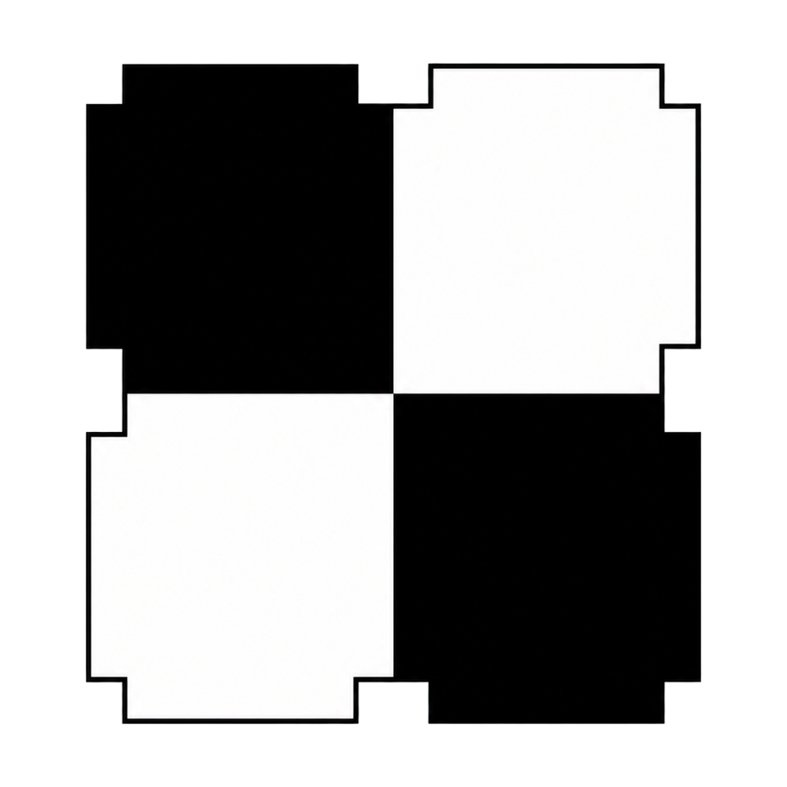

<div align="center">
  
  <h3>Xake</h3>
  <p>
    <a href="LICENSE"></a>
    <a href="https://github.com/neluj/Xake/releases"></a>
    <a href="https://github.com/neluj/Xake/actions/workflows/ci.yml"></a>
    <br>
    <a href="https://en.cppreference.com/w/cpp/20"></a>
    <a href="https://www.qt.io/product/framework"></a>
    <a href="https://cmake.org/"></a>
  </p>
</div>

Xake 0.3.0 is a desktop chess GUI for playing games and running matches between
UCI engines. It validates moves with its own legal move generator, manages chess
clocks, loads opening suites, records sessions, replays saved games and
tournaments, displays captured material, and shows engine communication for
diagnosis.

## Installation

The supported binary package is Windows x86-64:

1. Download the `Xake-0.3.0-Windows-*.zip` package.
2. Extract the complete archive to a writable directory.
3. Run `bin/Xake.exe`.

The packaged application contains its Qt and MinGW runtime dependencies. Qt,
MinGW, and their directories do not need to be installed or added to `PATH`.
The package is currently unsigned, so Windows SmartScreen may show a warning.

## Building

Requirements:

- A C++20 compiler.
- CMake 3.16 or newer.
- Qt 6.7 or newer with the Widgets, Svg, and Test modules.
- Ninja or another CMake-supported build tool.
- Python 3 only for the optional standalone perft suite script.

The official Windows package uses Qt 6.10.3 and MinGW 13.1. Example:

```powershell
cmake -S . -B build -G Ninja `
  -DCMAKE_BUILD_TYPE=Release `
  -DCMAKE_PREFIX_PATH=C:/Qt/6.10.3/mingw_64
cmake --build build --parallel
ctest --test-dir build --output-on-failure
cmake --build build --target package
```

The last command creates a ZIP package in the build directory. CMake runs Qt's
deployment script, which uses `windeployqt` on Windows.

## UCI Engines

Select an engine executable for either side in the game or tournament settings.
Xake supports the standard UCI startup and search flow, including `uci`,
`isready`, `ucinewgame`, `position`, timed `go`, `stop`, `quit`, and
`bestmove`. Time controls and increments are sent to engines in milliseconds.

Engine selections and paths from the most recent game and tournament, together
with their settings, are restored on the next launch. Xake does not bundle an
engine.

## Openings

Games and tournaments can start from a PGN or EPD opening file:

- PGN files use the main line of each game. `Opening`, `Variation`, `ECO`,
  `Event`, and `FEN` tags are used when available.
- EPD files provide one starting position per non-comment line. An `id`
  operation supplies the displayed opening name.
- Tournament games cycle through loaded entries. Opening moves and engine moves
  are visually distinguished in the Game and Tournament panels.

Invalid or ambiguous opening moves are rejected before a session starts.

## Tournaments

The current tournament runner manages a two-participant engine match. It
alternates colors between games, applies the selected clock and opening suite,
tracks win/loss/draw statistics, estimates Elo difference, and exports an
incremental report and PGN.

Pause stops the active search and resumes it with the remaining clock. Stop and
restart require confirmation. Starting a new session can terminate the active
one after confirmation.

## Replays

Use **Play > Replay game/tournament...** to open a saved game or tournament
directly, or select an entry in **History** and click **Replay selected**.
Replay supports:

- `session_*.json` game records.
- `tournament_report.json` reports, including incomplete tournaments.
- PGN files with one or more games.
- EPD files as collections of static positions.

Tournament reports and multi-game PGNs expose a game selector. **First**,
**Previous**, **Next**, and **Last** navigate without starting engines or chess
clocks. The board, move list, captured pieces, side to move, opening label, and
recorded clock values are reconstructed for the selected ply.

The Game tab displays the recorded result and termination reason in the same
place used for completed live games. Xake validates every imported move with
its legal move generator before entering Replay. JSON files produced by 0.2.0
remain supported; their final clocks are shown when available, while per-move
clocks are available in records
written by 0.3.0 or newer.

## Records and Logs

Session data is written below:

```text
%LOCALAPPDATA%\Xake\Xake\sessions
```

Each timestamped session directory can contain:

- `session_*.json`: current game or tournament state, including structured move
  records in 0.3.0 and newer.
- `game.pgn` or `tournament.pgn`: portable game notation.
- `tournament_report.json`: tournament summary and individual games.
- `uci_communication.log`: timestamped commands, engine output, and errors.

The History tab reads these records. Its columns are resizable and retain their
widths between launches. A standalone game or a complete tournament can be
deleted from History after confirmation; individual games inside a tournament
cannot be removed separately.

The Output tab displays current engine output, and the Debug window displays
the unified UCI communication log. Application settings are stored by
`QSettings`; on Windows this is under
`HKEY_CURRENT_USER\Software\Xake\Xake`.

Use **Settings > Manage application data...** to remove records, PGN files,
communication logs, or saved settings independently. Selecting everything
also removes Xake's empty local-data directories; external engines and opening
files are never deleted.

## Testing

The CTest suite covers FEN handling, legal move execution, move generation,
perft positions, clocks and game termination, settings, openings, replay,
tournament flow, session records, history, and widgets.

For release packaging and clean-environment checks, see
[`docs/RELEASE_WINDOWS.md`](docs/RELEASE_WINDOWS.md).

## Known Limitations

- The packaged release currently targets Windows x86-64 only.
- Tournaments contain two participants; multi-engine pairing is not
  implemented.
- UCI option discovery is displayed but there is no general engine-option
  editor. Hash is the only option configured directly.
- Pondering, remote engines, engine protocols other than UCI, and engine
  adjudication by evaluation are not supported.
- PGN import intentionally reads the main line and ignores variations,
  comments, and NAGs.
- The release archive is not code-signed.

## Project History and Author

Xake is developed and maintained by
[Julen Aristondo](https://github.com/neluj). It is the continuation of the
earlier ChessGame project, renamed to Xake in 2026.

Parts of the chess core and perft tooling share code and concepts with
[Akerbeltz](https://github.com/neluj/Akerbeltz), a UCI chess engine also
developed by Julen Aristondo.

The perft regression data in `tests/data/perftsuite.epd` was originally found
online and used by Akerbeltz. Its original author and source could not be
identified; Xake does not claim authorship of that data.

- Source code: https://github.com/neluj/Xake
- Issues: https://github.com/neluj/Xake/issues

## License

Xake source code is licensed under GPL-3.0-only. Third-party components and
assets have their own terms; see
[`THIRD_PARTY_NOTICES.md`](THIRD_PARTY_NOTICES.md), the `licenses` directory,
and [`QT_SOURCE_OFFER.md`](QT_SOURCE_OFFER.md).
